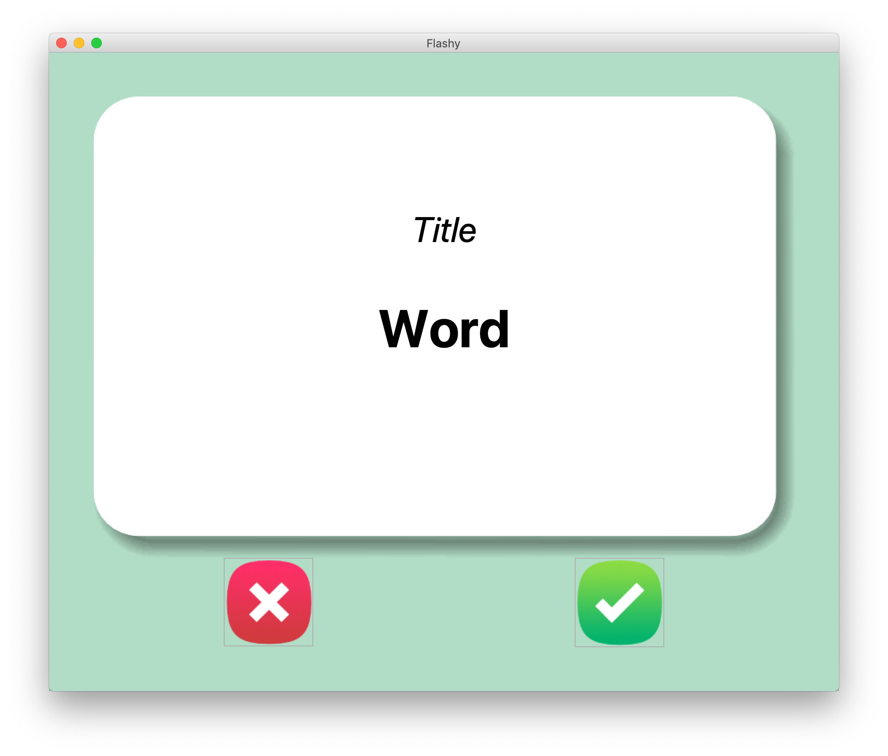
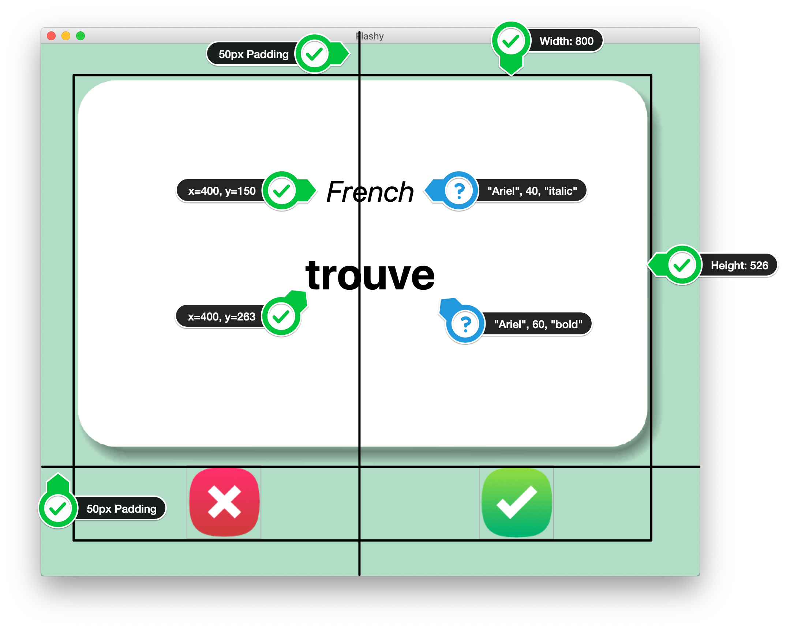

### Step 1 - Create the User Interface (UI) with Tkinter

1. Download the starting files from the course resources.

2. Use the images in the image folder, to create the following user interface. The ❌ and ✅ are buttons. You can add images to buttons like this:

~~~Python
my_image = PhotoImage(file="path/to/image_file.png")
button = Button(image=my_image, highlightthickness=0)
~~~

3. Here are some hints for the fonts, measurements and positioning.

#### HINTS:

1. You will need a 2 X 2 grid, with the flash card taking up 2 columns.

2. The flash card is a Canvas with 1 image and 2 pieces of text.

3. The image is card_front.png, created from the PhotoImage class. Be careful about the full image path as the image is inside the image folder.

 

IR PARA [**STEP 2**](./step2.md)

 

[**RETURN**](../README.md)
