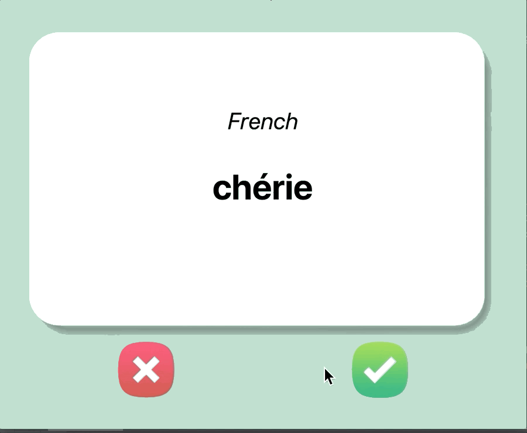

### Step 2 - Create New Flash Cards

1. Read the data from the french_words.csv file in the data folder

2. Pick a random French word/translation and put the word into the flashcard. Every time you press the ❌ or ✅ buttons, it should generate a new random word to display

 

#### HINT:

1. You'll need to use pandas to access the CSV file and generate a data frame. To get all the words/translation rows out as a list of dictionaries [{french_word: english_word}, {french_word2: english_word2}, {french_word3: english_word3}]

You could use:

~~~Python
DataFrame.to_dict(orient="records")
~~~

 

Documentação: [**pandas**](https://pandas.pydata.org/pandas-docs/stable/reference/api/pandas.DataFrame.to_dict.html)

 

IR PARA -> [**STEP 3**](./step3.md)

 

[**RETURN**](./step1.md)
