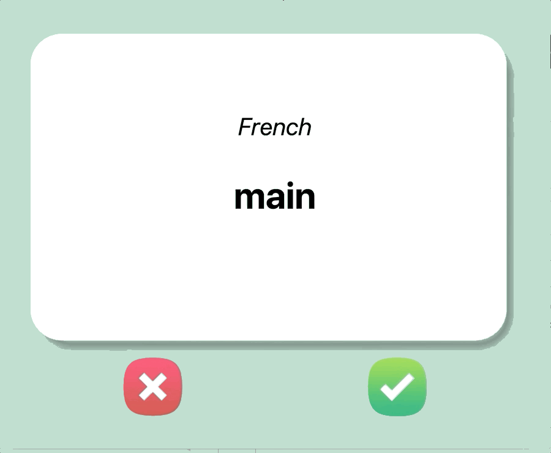

### Step 3 - Flip the Cards

1. After a delay of **3s** (3000ms), the card should flip and display the English translation for the current word

2. The card image should change to the card_back.png and the text colour should change to white. The title of the card should change to "English" from "French"

#### HINTS:

1. To change the canvas image, you'll need a reference to the image, like what you have with the text created in the canvas. Then you can set the image attribute using **itemconfig()**

~~~Python
new_image = PhotoImage(file="new_image.png")
old_image = PhotoImage(file="old_image.png")
canvas_image = canvas.create_image(300, 300, image=old_image)
#To change the image:
canvas.itemconfig(canvas_image, image=new_image)
~~~

`IMPORTANT: PhotoImage objects should not be created inside a function. Otherwise, it will not work`

2. To change the color of the text in a canvas element, use the fill parameter 

[how-can-i-change-the-color-of-text-in-tkinter](https://stackoverflow.com/questions/41030973/how-can-i-change-the-color-of-text-in-tkinter)

3. Remember in the mainloop() you should not create additional delayed loops with time.sleep() but instead, use window.after() Tkinter Reference Manual

4. You can cancel a **window.after()** loop using window.after_cancel() Tkinter Reference Manual

 

IR PARA -> [**STEP 3**](./step4.md)

 

[**RETURN**](./step2.md)
