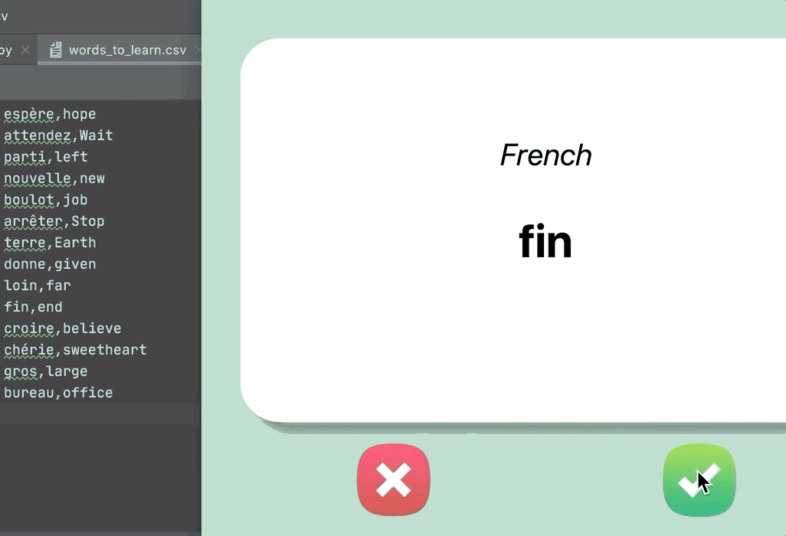

### Step 4 - Save Your Progress

1. When the user presses on the ✅ button, it means that they know the current word on the flashcard and that word should be removed from the list of words that might come up.

> If french_words.csv had only 3 records:

~~~Shell
chaque,each
parlé,speak
arrivé,come
~~~

`After the user has seen parlé,speak  it should be removed from the list of words that can come up again`

2. The updated data should be saved to a new file called words_to_learn.csv

> words_to_learn.csv

~~~Shell
chaque,each
arrivé,come
~~~

3. The next time the program is run, it should check if there is a words_to_learn.csv file. If it exists, the program should use those words to put on the flashcards. If the words_to_learn.csv does not exist (the first time the program is run), then it should use the words in the french_words.csv

`We want our flashcard program to only test us on things we don't know. So if the user presses the ✅ button, that means the current card should not come up again`

 

#### HINTS:

1. The **remove()** method can remove elements from a list

[ref-list-remove](https://www.w3schools.com/python/ref_list_remove.asp)

2. You can create a new csv file from a dictionary using **DataFrame.to_csv()**

[**pandas-DataFrame-to-csv**](https://pandas.pydata.org/pandas-docs/stable/reference/api/pandas.DataFrame.to_csv.html)

3. If you don't want to create an index for the new csv, you can set the index parameter to False

~~~Python
data.to_csv("filename.csv", index=False)
~~~

 

IR PARA -> [**HOME**](../README.md)

 

[**RETURN**](./step3.md)
