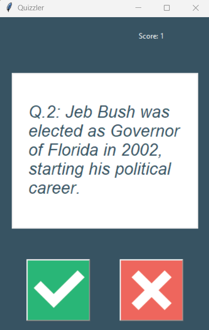

### API Pratice - Creating a GUI Quiz App

#### Links uteís

| **Documentação**                                                                                                      |
| --------------------------------------------------------------------------------------------------------------------- |
| [Open Trivia Database](https://opentdb.com/)                                                                          |
| [HTML Entities](https://www.w3schools.com/html/html_entities.asp)                                                     |
| [HTML Escape / Unescape](https://www.freeformatter.com/html-escape.html#google_vignette)                              |
| [HTML Escape / Unescape](https://stackoverflow.com/questions/2087370/decode-html-entities-in-python-string)           |
| [How to wrap text within Tkinter Text Box?](https://www.geeksforgeeks.org/how-to-wrap-text-within-tkinter-text-box/)  |
| [How to wrap text within Tkinter Text Box?](https://www.geeksforgeeks.org/how-to-disable-enable-a-button-in-tkinter/) |

####  API

**API (Application Programming Interface)** é um conjunto de definições e protocolos que permite que diferentes softwares se comuniquem entre si. As APIs definem os métodos e dados que os desenvolvedores podem usar para interagir com um serviço, biblioteca ou sistema operacional

 

#### Import libs

~~~Python
import requests
import tkinter
import html
~~~

 

#### Tela sistema

 

[**HOME**](#api-pratice---creating-a-gui-quiz-app)
