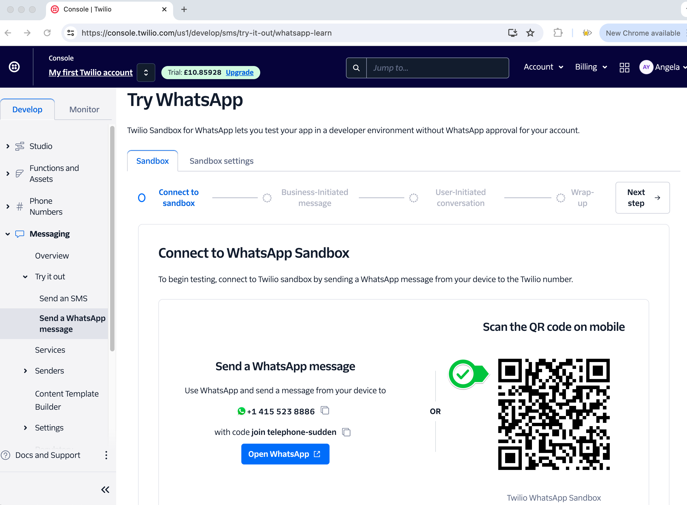
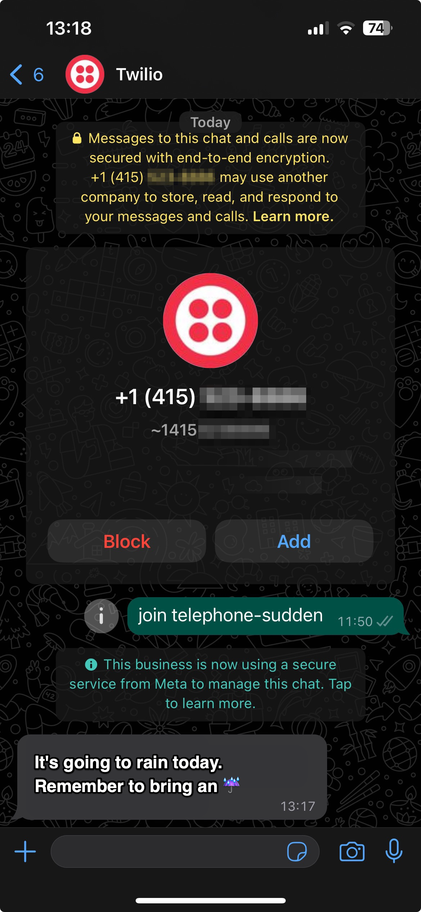

### API Pratice - Creating a GUI Quiz App

#### Links uteís

| **Documentação**                                                                                      |
| ----------------------------------------------------------------------------------------------------- |
| [openweathermap](https://home.openweathermap.org/users/sign_up)                                       |
| [Current weather data](https://openweathermap.org/current)                                            |
| [latlong.net](https://www.latlong.net/)                                                               |
| [jsonviewer](https://jsonviewer.stack.hu/)                                                            |
| [5 day weather forecast](https://openweathermap.org/forecast5)                                        |
| [Weather condition codes](https://openweathermap.org/weather-conditions#Weather-Condition-Codes-2)    |
| [ventusky](https://www.ventusky.com/)                                                                 |
| [how-slicing-in-python-works](https://stackoverflow.com/questions/509211/how-slicing-in-python-works) |
| [twilio](https://login.twilio.com/u/signup?state=hKFo2SBXNVg1dExWRm1ab3RkZ1Mwc3FWM0NrUmczOVZhejZxZKFur3VuaXZlcnNhbC1sb2dpbqN0aWTZIFNHcGkxb3ZCeXdMdnA1NXVZZUZSYXR6LTR3YWZWXzc0o2NpZNkgTW05M1lTTDVSclpmNzdobUlKZFI3QktZYjZPOXV1cks) |
| [Programmable Messaging Quickstart - Python](https://www.twilio.com/docs/messaging/quickstart/python) |
| [pythonanywhere](https://www.pythonanywhere.com/)                                                     |
| [TwilioBehindTheProxy](https://help.pythonanywhere.com/pages/TwilioBehindTheProxy/)                   |
| [Environment variable](https://en.wikipedia.org/wiki/Environment_variable)                            |
| [API list](https://apilist.fun/)                                                                      |

#### Complemento

- Não consegue usar SMS? __Experimente o WhatsApp__

- Você mora nos EUA ou no Canadá? __Se sim, as únicas mensagens que você poderá enviar com uma conta gratuita serão simuladas e limitadas ao Telefone Virtual no site da Twilio. Para os fins deste projeto, o telefone simulado. Alternativamente, você pode usar o WhatsApp__

- Por que não é possível enviar mensagens para um telefone real? __Devido a uma mudança na lei, a partir de 31 de janeiro de 2024, ninguém poderá enviar mensagens SMS originadas de um Número Gratuito (TFN) nos EUA ou Canadá, a menos que o TFN tenha sido verificado, o usuário seja verificado e o conteúdo a ser transmitido também seja verificado. Essa verificação pode levar de 2 a 4 semanas. Isso é um pouco demais para prática de programação__

- Conecte o Twilio e o WhatsApp

Acesse o Twilio Sandbox para WhatsApp: https://console.twilio.com/us1/develop/sms/try-it-out/whatsapp-learn

- e conecte sua conta do WhatsApp apontando a câmera para o código QR:

- Depois de entrar no Twilio Sandbox, basta alterar o código Python para usar o WhatsApp:

~~~Python
message = client.messages.create(
  from_="whatsapp:TWILIO_WHATSAPP_NUMBER",
  body="It's going to rain today. Remember to bring an umbrella",
  to="whatsapp:YOUR_TWILIO_VERIFIED_NUMBER"
)
~~~

Você poderá receber mensagens como esta:

 

#### Criando VARIABLE_ENV no `pythonanywhere`

> export __NOME_VARIAVEL=VALOR__

exemplo:

~~~Bash
export OWM_API_KEY=69f04e4613056b159c2761a9d9e664d2
~~~

