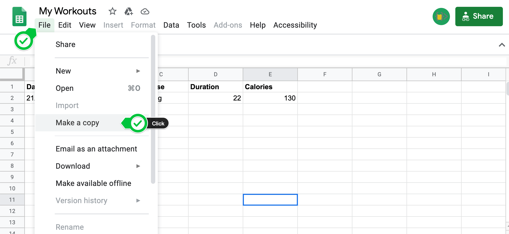
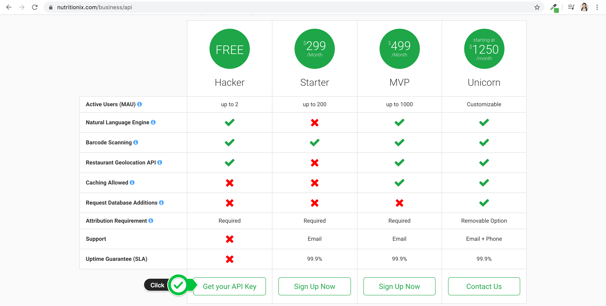
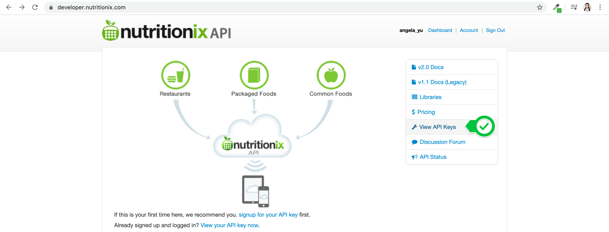
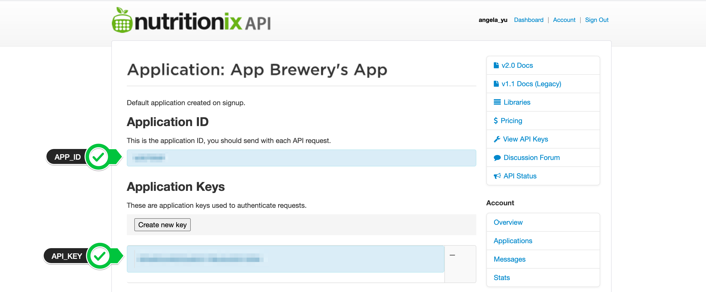

# Etapa 1 - Configurar as credenciais da API e a Planilha Google

1. Acesse este link e crie uma cópia da Planilha Meus Treinos. Pode ser necessário fazer login/cadastro.

Ex.:

Você também pode criar sua própria planilha, se desejar.

2. Acesse o site da [API da Nutritionix](https://www.nutritionix.com/business/api) e selecione "Obter sua chave de API" para criar uma conta gratuita. Verifique sua caixa de spam (e/ou a aba "promoções" do Gmail) para encontrar o e-mail de verificação da Nutritionix.

3. Após o login, você poderá acessar sua chave de API e o ID do aplicativo:

4. Crie um novo projeto no PyCharm e, em main.py, crie 2 constantes para armazenar o APP_ID e a API_KEY que você obteve da Nutritionix.

[**[ IR PARA STEP 2 ]**](step2.md)

[**[ INICIO ]**](#etapa-1---configurar-as-credenciais-da-api-e-a-planilha-google)

[**[ VOLTAR README ]**](../README.md)
