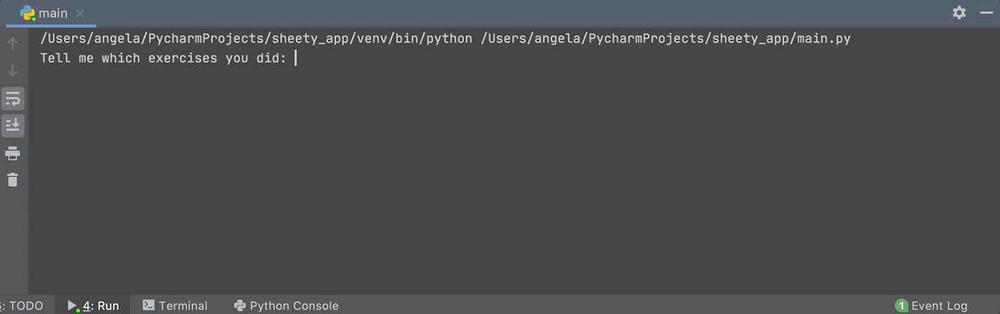

# Etapa 2 - Obtenha estatísticas de exercícios com consultas em linguagem natural

1. Usando o Guia da API Nutritionix, descubra como imprimir as estatísticas do exercício para entrada de texto simples.

Por enquanto, você pode codificar a chave de API e o ID do aplicativo. Na etapa 6, armazenaremos a chave de API e o ID do aplicativo como variáveis ​​de ambiente.

**DICA 1**: Use o que você aprendeu sobre [Cabeçalhos de Autenticação](https://docx.syndigo.com/developers/docs/understand-request-headers) e Entendendo Cabeçalhos de Solicitação para autenticar sua solicitação.

**DICA 2**: Use o que você aprendeu sobre como fazer solicitações POST, [Linguagem Natural](https://docx.syndigo.com/developers/docs/natural-language-for-exercise) para [Exercícios e Parâmetros](https://trackapi.nutritionix.com/docs/#/default/post_v2_natural_exercise) para criar sua solicitação com os parâmetros necessários.

[**SOLUÇÃO**](https://gist.github.com/angelabauer/dd71d7072626afd728e1730584c6e4b8)

[**[ IR PARA STEP 3 ]**](step3.md)

[**[ INICIO ]**](#etapa-2---obtenha-estatísticas-de-exercícios-com-consultas-em-linguagem-natural)

[**[ VOLTAR README ]**](../README.md)
