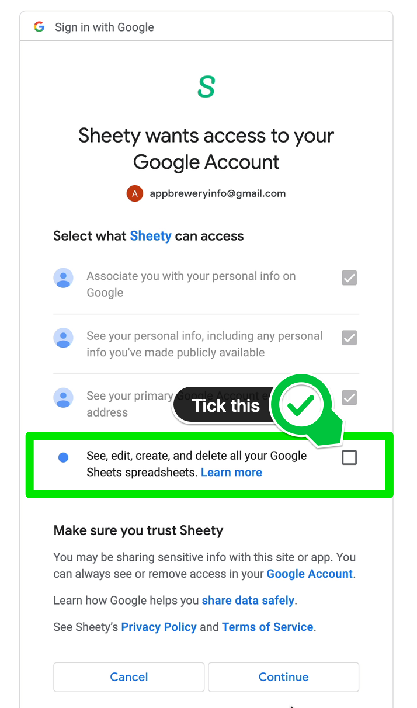
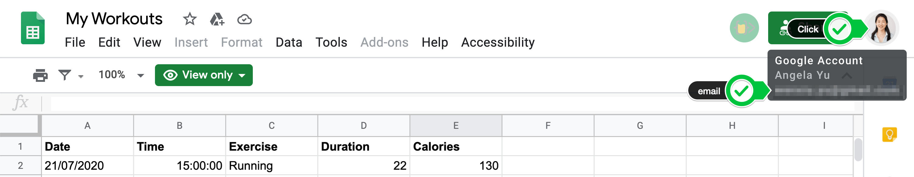
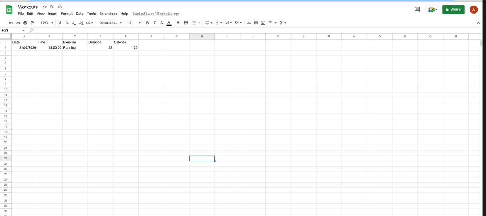
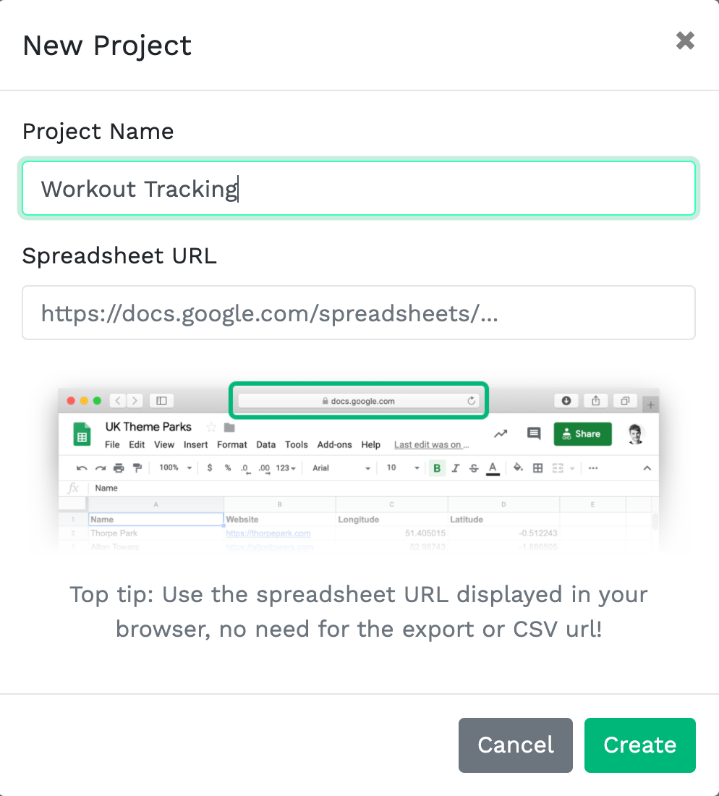
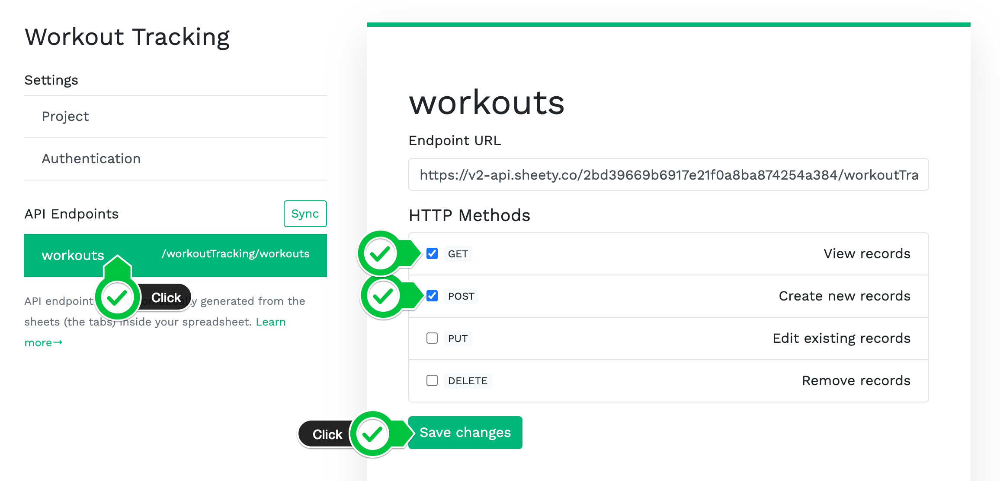

# Etapa 3 - Configure sua Planilha Google com o Sheety

1. [Entre no Sheety](https://sheety.co/) com sua Conta do Google (a mesma conta que possui a Planilha Google que você copiou na etapa 1).

Certifique-se de dar permissão ao Sheety para acessar suas Planilhas Google. Se você pular esta etapa, saia do Sheety e entre novamente.

Certifique-se de que o e-mail entre sua Planilha Google e sua conta Sheety corresponda. Por exemplo:

Nas configurações de Segurança da sua Conta do Google, você verá que o Sheety tem acesso. Verifique novamente se o Sheety está listado como um aplicativo autorizado. Caso contrário, seu código Python não conseguirá acessar sua planilha.

2. Na página do seu projeto, clique em "Novo projeto" e crie um novo projeto no Sheety com o nome "Acompanhamento de treinos" e cole a URL da sua planilha do Google "Meus treinos".

3. Clique no ponto de extremidade da API de exercícios e ative GET e POST.

[Api do Sheety](https://sheety.co/)

[**[ IR PARA STEP 4 ]**](step4.md)

[**[ INICIO ]**](#etapa-3---configure-sua-planilha-google-com-o-sheety)

[**[ VOLTAR README ]**](../README.md)
