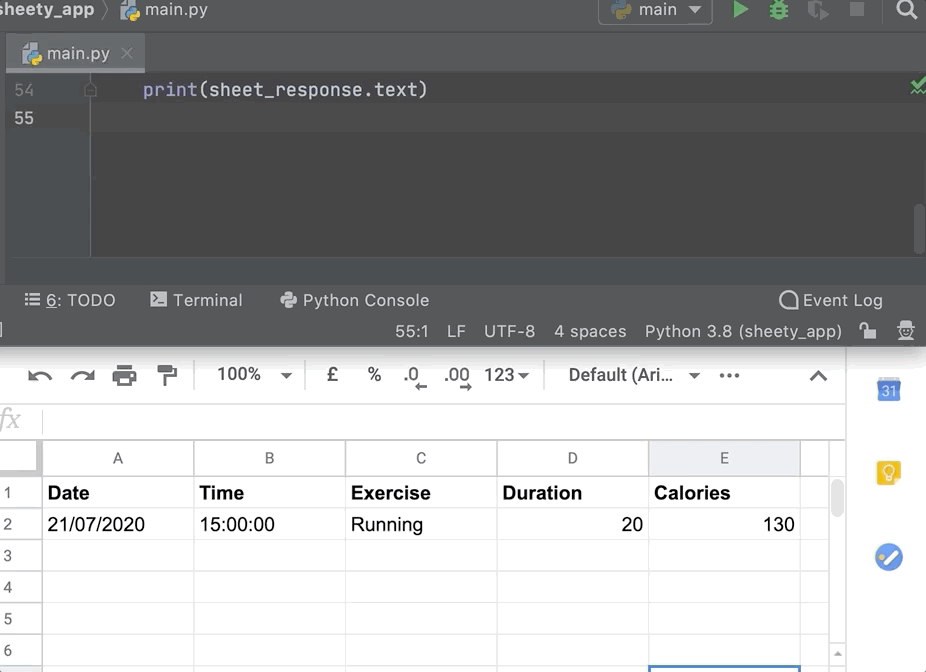
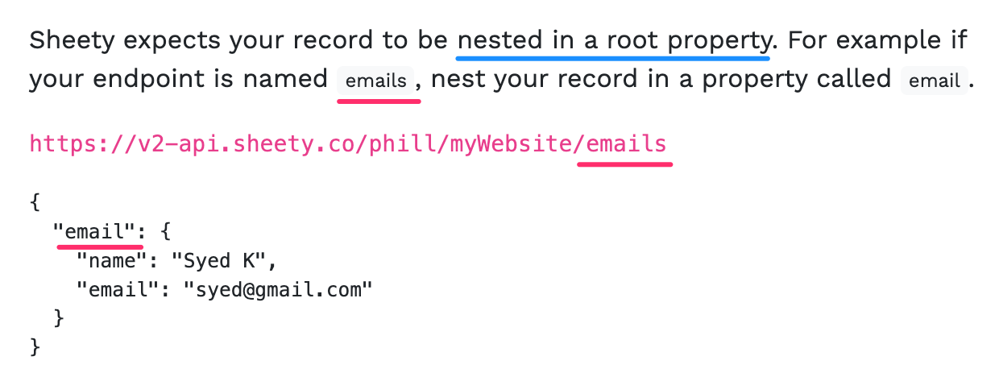

# Etapa 4 - Salvando dados no Planilhas Google

1. Usando a [documentação do Sheety](https://sheety.co/docs/requests), escreva um código para usar a API do Sheety para gerar uma nova linha de dados na sua Planilha Google para cada um dos exercícios que você receber da API Nutritionix. As colunas de data e hora devem conter a data e a hora atuais do módulo datetime do Python.

**DICA 1**: Os parâmetros devem ser camelCase. Preste atenção especial a esta parte da documentação:

**DICA 2**: Lembre-se de que você pode gerar texto em maiúsculas usando o método .title() do Python.

[doc ref_string_title](https://www.w3schools.com/python/ref_string_title.asp)

**DICA 3**: Lembre-se de que você pode formatar um objeto datetime usando o método .strftime().

[doc python_datetime](https://www.w3schools.com/python/python_datetime.asp)

Depuração 🐞 Dica: Se estiver com problemas, verifique novamente se você está conectado ao Sheety com a mesma conta do Google que possui a planilha que você está tentando modificar.

[**SOLUÇÃO**](https://gist.github.com/angelabauer/164864b78175bb1ecd3d3fd7f4ee39b7)

[**[ IR PARA STEP 5 ]**](step5.md)

[**[ INICIO ]**](#etapa-4---salvando-dados-no-planilhas-google)

[**[ VOLTAR README ]**](../README.md)
