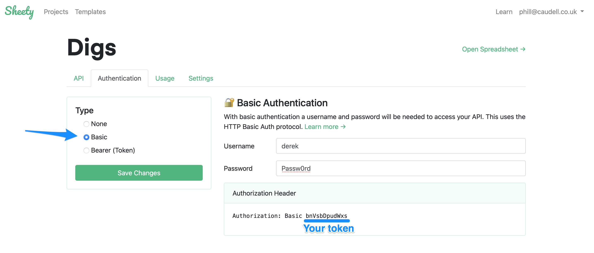

# Etapa 5 - Autenticação da API Sheety

No momento, não há necessidade de autenticação para acessar seu endpoint do Sheety. Isso significa que qualquer pessoa pode ler e escrever na sua Planilha Google "Meu Treino".

1. Adicione "Autenticação Básica" ou "Token do Portador" ao seu endpoint do Sheety para protegê-lo. Você pode codificar o token no seu código enquanto o testa. Assim que tiver certeza de que funciona, podemos adicioná-lo às variáveis ​​de ambiente na próxima etapa.

###### O que é autenticação de portadora?

A autenticação de portadora (também conhecida como autenticação de token) é um esquema de autenticação HTTP que envolve tokens de segurança. O nome "autenticação de portadora" significa basicamente "dar acesso ao portador deste token". O token de segurança ou "token de portador" é apenas uma string criptografada. Um exemplo de token de portador seria uma string semelhante a esta:

"AAAAAAAAAAAAAAAAAAAAAAAAMLheAAAAAAAA0%2BuSeid%2BULvsea4JtiGRiSDSJSI%3DEUifiRBkKG5E2XzMDjRfl76ZC9Ub0wnz4XsNiRVBChTYbJcE3F"

A ideia é que quem tiver o token secreto tenha permissão para interagir com a planilha. Um cliente - como seu navegador ou aplicativo móvel - enviaria esse token de segurança no cabeçalho de autorização ao fazer solicitações ao servidor do Sheety.

2. Use a [documentação do Sheety](https://sheety.co/docs/authentication.html) sobre autenticação para atualizar seu código Python e autenticar sua requisição.

DICA: Você precisará ler a seção relevante na documentação do módulo de requisição para fazer isso.

[Requisições - Autenticação Básica HTTP](https://requests.readthedocs.io/en/latest/user/authentication/#basic-authentication)

[Bearer Authentication: https://stackoverflow.com/questions/29931671/making-an-api-call-in-python-with-an-api-that-requires-a-bearer-token](https://stackoverflow.com/questions/29931671/making-an-api-call-in-python-with-an-api-that-requires-a-bearer-token)

[SOLUÇÃO](https://gist.github.com/TheMuellenator/974c39779ec516c4c60e918c001e48ba)

[**SOLUÇÃO**](https://gist.github.com/angelabauer/164864b78175bb1ecd3d3fd7f4ee39b7)

[**[ IR PARA STEP 6 ]**](step6.md)

[**[ INICIO ]**](#etapa-5---autenticação-da-api-sheety)

[**[ VOLTAR README ]**](../README.md)
