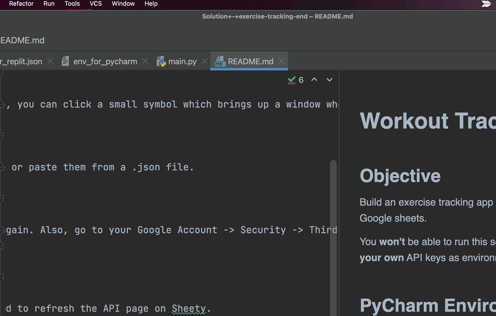
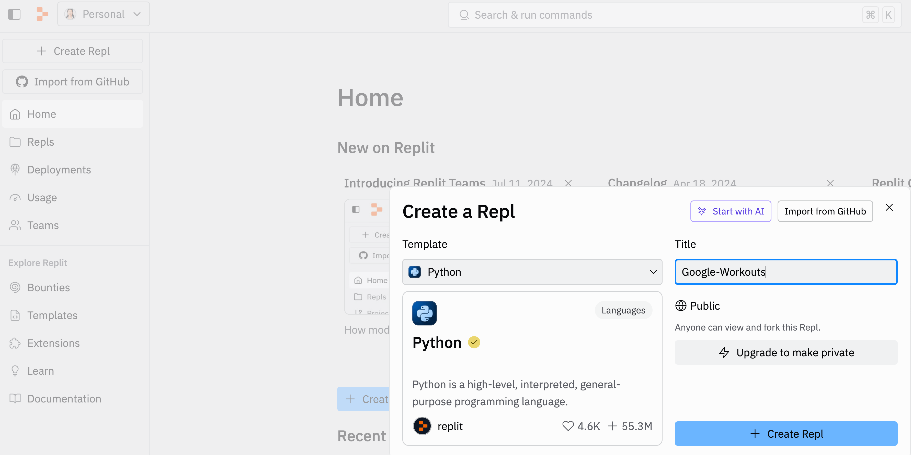
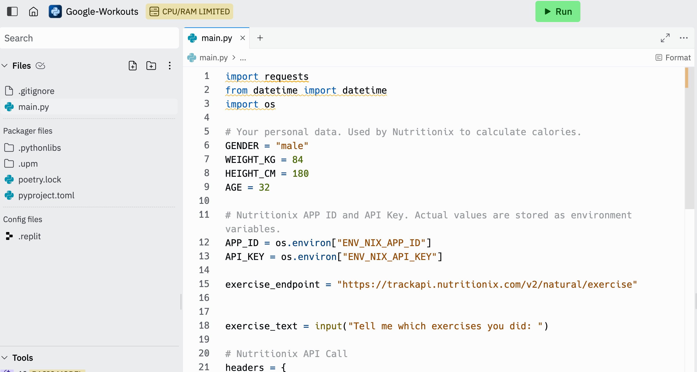
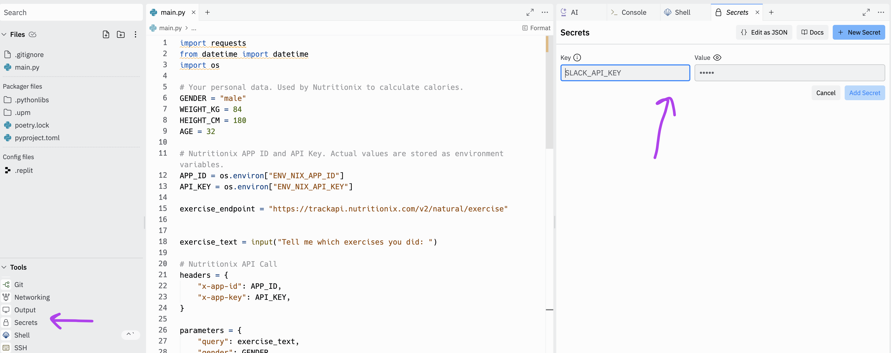

# Etapa 6 - Variáveis ​​de ambiente

É hora de remover as chaves de API, senhas e endpoints codificados do nosso arquivo .py e movê-los para variáveis ​​de ambiente. O processo será ligeiramente diferente dependendo do seu ambiente.

1. Usando o que você sabe sobre Variáveis ​​de Ambiente ([veja o Dia 35](https://www.udemy.com/course/100-days-of-code/learn/lecture/21326814)), atualize seu código para usar variáveis ​​de ambiente para todos os dados sensíveis, incluindo:

`ID_DO_APLICATIVO`

`CHAVE_DA_API`

`PONTO_DO_PARA_FOLHA`

`NOME_DE_USUÁRIO`

`SENHA`

`TOKEN`

**DICA 1**: Você precisará importar o módulo os.

Veja como você definiria variáveis ​​de ambiente

~~~Python
os.environ["APP_ID"] = APP_ID
~~~

e aqui está como você obteria uma variável de ambiente

~~~Python
APP_ID = os.environ["APP_ID"] – raises exception if key does not exist
APP_ID = os.environ.get("APP_ID") – returns None if key does not exist
APP_ID = os.environ.get("APP_ID", “Message”) – returns “Message” if key does not exist
~~~

Veja Python | [objeto os.environ](https://www.geeksforgeeks.org/python-os-environ-object/)

No PyCharm, [você pode adicionar suas variáveis ​​de ambiente em "Editar Configurações"](https://stackoverflow.com/questions/42708389/how-to-set-environment-variables-in-pycharm). Se clicar no pequeno símbolo à direita em "Variáveis ​​de Ambiente", será aberta uma janela onde você poderá adicionar os pares chave-valor um por um. (Você também pode copiar e colar todas as variáveis ​​de ambiente ao mesmo tempo).

2. [OPTIONAL] Para podermos postar nossos dados de treino enquanto estamos fora de casa, seria mais fácil se pudéssemos acessar o console e executar o código em um navegador.

Podemos fazer isso usando [Repl.it](https://replit.com/)

Esta é uma ferramenta gratuita, mas requer cadastro por e-mail. Portanto, é totalmente opcional se você quiser usá-la. Não é exatamente para aprender Python, mas seria legal ter este "aplicativo" acessível a partir de um navegador web em dispositivos móveis.

**Passo 1**: Crie uma conta gratuita em [https://replit.com/](https://replit.com/)

**Passo 2**: Crie um novo Repl e nomeie-o Google-Workouts

**Passo 3**: Copie e cole todo o seu código em main.py no Replit.

No entanto, como os projetos do Repl.it são públicos, não queremos que outras pessoas vejam nossas chaves de API e segredos.

**Passo 4**: Adicione variáveis ​​de ambiente ao Replit e armazene suas Variáveis ​​de Ambiente acessando a aba "Segredos" e adicionando cada variável de ambiente como um par de chave-valor:

[Espaço de Trabalho do Replit - Recursos do Espaço de Trabalho - Segredos](https://docs.replit.com/replit-workspace/workspace-features/secrets)

**DICA 1**: As variáveis ​​de ambiente são declaradas sem espaços!

**DICA 2**: [https://stackoverflow.com/questions/4906977/how-to-access-environment-variable-values](https://stackoverflow.com/questions/4906977/how-to-access-environment-variable-values)

**Passo 5**: Agora você pode abrir o mesmo projeto no navegador do seu celular e clicar em executar para usar o aplicativo em qualquer lugar!

[SOLUÇÃO](https://gist.github.com/angelabauer/2e147663f998bbcf7b403c6c83f56a14)

[**[ INICIO ]**](#etapa-6---variáveis-de-ambiente)

[**[ VOLTAR README ]**](../README.md)
